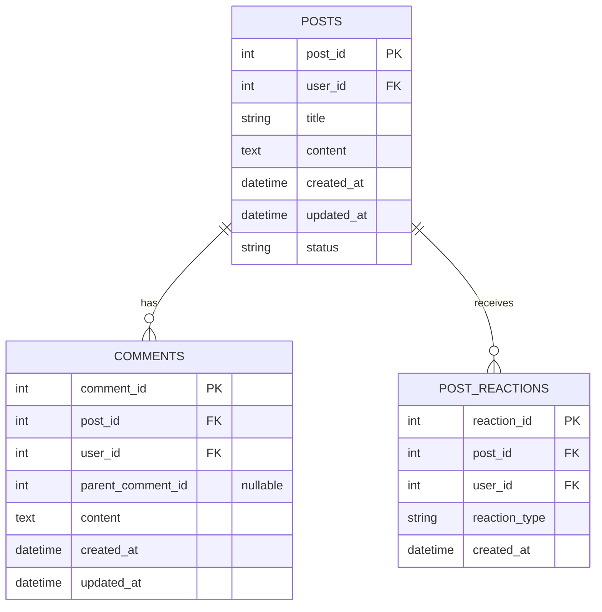

```mermaid
erDiagram
    POSTS {
        int post_id PK
        int user_id FK
        string title
        text content
        datetime created_at
        datetime updated_at
        string status
    }
    COMMENTS {
        int comment_id PK
        int post_id FK
        int user_id FK
        int parent_comment_id "nullable"
        text content
        datetime created_at
        datetime updated_at
    }
    POST_REACTIONS {
        int reaction_id PK
        int post_id FK
        int user_id FK
        string reaction_type
        datetime created_at
    }

    POSTS ||--o{ COMMENTS : "has"
    POSTS ||--o{ POST_REACTIONS : "receives"

```