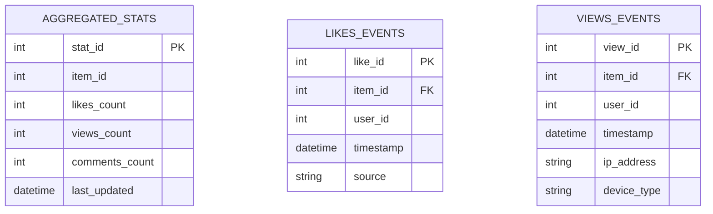

```mermaid
erDiagram
    AGGREGATED_STATS {
        int stat_id PK
        int item_id
        int likes_count
        int views_count
        int comments_count
        datetime last_updated
    }
    LIKES_EVENTS {
        int like_id PK
        int item_id FK
        int user_id
        datetime timestamp
        string source
    }
    VIEWS_EVENTS {
        int view_id PK
        int item_id FK
        int user_id
        datetime timestamp
        string ip_address
        string device_type
    }

```