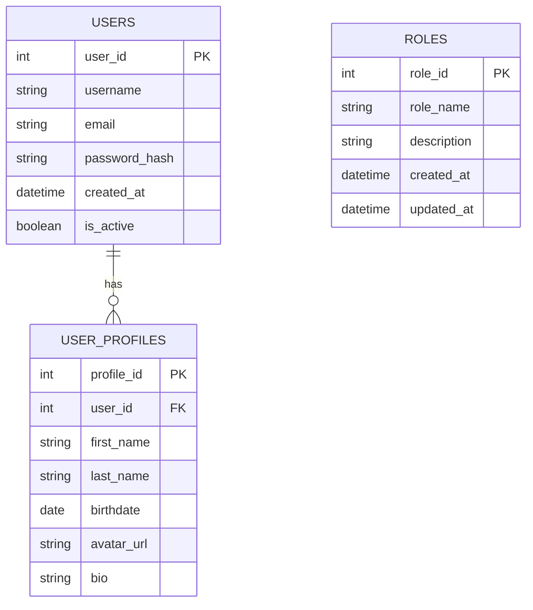

```mermaid
erDiagram
    USERS {
        int user_id PK
        string username
        string email
        string password_hash
        datetime created_at
        boolean is_active
    }
    ROLES {
        int role_id PK
        string role_name
        string description
        datetime created_at
        datetime updated_at
    }
    USER_PROFILES {
        int profile_id PK
        int user_id FK
        string first_name
        string last_name
        date birthdate
        string avatar_url
        string bio
    }

    USERS ||--o{ USER_PROFILES : "has"
```